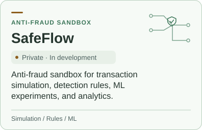
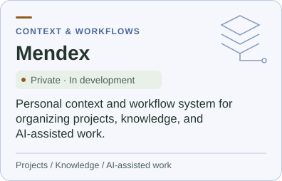
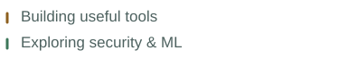
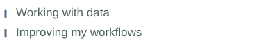

<picture>
  <source media="(prefers-color-scheme: dark)" srcset="./assets/banner-dark.png">
  <source media="(prefers-color-scheme: light)" srcset="./assets/banner-light.png">
  
</picture>

### Hi, I'm mendozie 👋

I build practical tools, explore security analytics and data, and turn ideas into working projects.

<picture>
  <source media="(prefers-color-scheme: dark)" srcset="./assets/typing-dark.svg">
  <source media="(prefers-color-scheme: light)" srcset="./assets/typing-light.svg">
  
</picture>

<picture>
  <source media="(prefers-color-scheme: dark)" srcset="./assets/badge-python-dark.svg">
  <source media="(prefers-color-scheme: light)" srcset="./assets/badge-python-light.svg">
  
</picture>
<picture>
  <source media="(prefers-color-scheme: dark)" srcset="./assets/badge-security-dark.svg">
  <source media="(prefers-color-scheme: light)" srcset="./assets/badge-security-light.svg">
  
</picture>
<picture>
  <source media="(prefers-color-scheme: dark)" srcset="./assets/badge-data-dark.svg">
  <source media="(prefers-color-scheme: light)" srcset="./assets/badge-data-light.svg">
  
</picture>
<picture>
  <source media="(prefers-color-scheme: dark)" srcset="./assets/badge-automation-dark.svg">
  <source media="(prefers-color-scheme: light)" srcset="./assets/badge-automation-light.svg">
  
</picture>

### Selected Projects

<picture>
  <source media="(prefers-color-scheme: dark)" srcset="./assets/project-safeflow-dark.svg">
  <source media="(prefers-color-scheme: light)" srcset="./assets/project-safeflow-light.svg">
  
</picture>
<picture>
  <source media="(prefers-color-scheme: dark)" srcset="./assets/project-mendex-dark.svg">
  <source media="(prefers-color-scheme: light)" srcset="./assets/project-mendex-light.svg">
  
</picture>

### Currently

<picture>
  <source media="(prefers-color-scheme: dark)" srcset="./assets/focus-building-dark.svg">
  <source media="(prefers-color-scheme: light)" srcset="./assets/focus-building-light.svg">
  
</picture>
<picture>
  <source media="(prefers-color-scheme: dark)" srcset="./assets/focus-workflow-dark.svg">
  <source media="(prefers-color-scheme: light)" srcset="./assets/focus-workflow-light.svg">
  
</picture>

