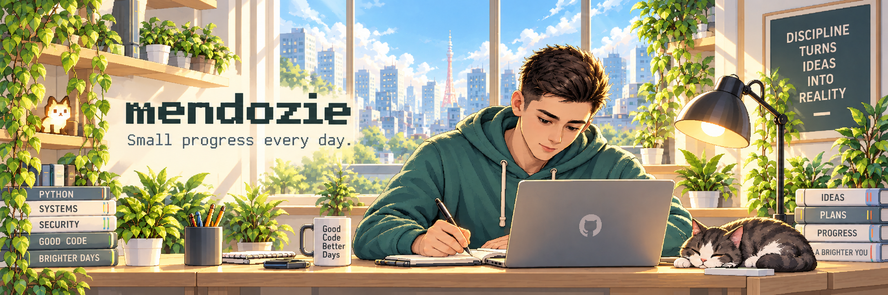

<picture>
  <source media="(prefers-color-scheme: dark)" srcset="./assets/banner-dark.png">
  <source media="(prefers-color-scheme: light)" srcset="./assets/banner-light.png">
  
</picture>

## Hi, I'm mendozie 👋

I build practical tools, explore security analytics and data, and turn ideas into working projects.

Curious by default. Always building.

`Python` · `Security Analytics` · `Data` · `Automation`

## Selected Projects

### SafeFlow

**Private · In development**

Anti-fraud sandbox for transaction simulation, detection rules, ML experiments, and analytics.

### Mendex

**Private · In development**

Personal context and workflow system for organizing projects, knowledge, and AI-assisted work.

## Currently

- Building useful tools
- Exploring security & ML
- Working with data
- Improving my workflows
